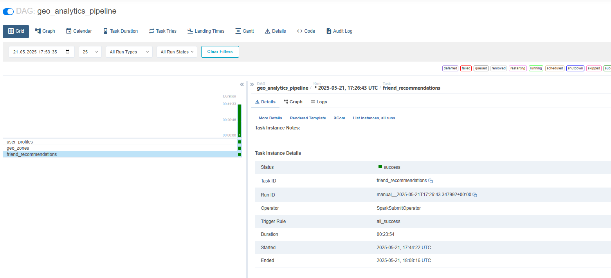

# Выполненная работа

# Структура Data Lake для проекта социальной сети
## Вариант 1. Задаем yarn переменные окружения Spark для взаимодействия с YARN.

from datetime import datetime, timedelta
from pyspark.sql import SparkSession, functions as F
from pyspark.sql.window import Window
import os

os.environ['HADOOP_CONF_DIR'] = '/etc/hadoop/conf'
os.environ['YARN_CONF_DIR'] = '/etc/hadoop/conf'
os.environ['JAVA_HOME'] = '/usr/lib/jvm/java-8-openjdk-amd64'

spark = SparkSession.builder \
    .master("yarn") \
    .appName("Events for 2022-05-31") \
    .config("spark.executor.memory", "4g") \
    .config("spark.driver.memory", "2g") \
    .config("spark.executor.instances", "2") \
    .config("spark.dynamicAllocation.minExecutors", "2") \
    .getOrCreate()

## Вариант 2. Задаем local переменные окружения Spark для взаимодействия с YARN.
from datetime import datetime, timedelta
from pyspark.sql import SparkSession, functions as F
from pyspark.sql.window import Window
import os

os.environ['HADOOP_CONF_DIR'] = '/etc/hadoop/conf'
os.environ['YARN_CONF_DIR'] = '/etc/hadoop/conf'
os.environ['JAVA_HOME'] = '/usr/lib/jvm/java-8-openjdk-amd64'

spark = SparkSession.builder \
    .master("local[4]") \
    .appName("Project") \
    .getOrCreate()

## Директории

### 1. Исходные данные
- `/user/master/data/geo/events/` - сырые данные событий 
схема данных:
    root
     |-- event: struct (nullable = true)
     |    |-- admins: array (nullable = true)
     |    |    |-- element: long (containsNull = true)
     |    |-- channel_id: long (nullable = true)
     |    |-- datetime: string (nullable = true)
     |    |-- media: struct (nullable = true)
     |    |    |-- media_type: string (nullable = true)
     |    |    |-- src: string (nullable = true)
     |    |-- message: string (nullable = true)
     |    |-- message_channel_to: long (nullable = true)
     |    |-- message_from: long (nullable = true)
     |    |-- message_group: long (nullable = true)
     |    |-- message_id: long (nullable = true)
     |    |-- message_to: long (nullable = true)
     |    |-- message_ts: string (nullable = true)
     |    |-- reaction_from: string (nullable = true)
     |    |-- reaction_type: string (nullable = true)
     |    |-- subscription_channel: long (nullable = true)
     |    |-- subscription_user: string (nullable = true)
     |    |-- tags: array (nullable = true)
     |    |    |-- element: string (containsNull = true)
     |    |-- user: string (nullable = true)
     |-- event_type: string (nullable = true)
     |-- lat: double (nullable = true)
     |-- lon: double (nullable = true)
     |-- date: date (nullable = true)

- `/user/tanyademi1/data/geo/cities/geo.csv` - справочник городов - файл geo.csv со структурой данных
обработан исправлено название столбца на верное lon, в значениях широта и долготота использована "точка" вместо "запятой" и разделитель колонок "запятая" вместо "точки с запятой"
    +---+----------+--------+--------+
    | id|      city|     lat|     lon|
    +---+----------+--------+--------+
    |  1|    Sydney| -33.865|151.2094|
    |  2| Melbourne|-37.8136|144.9631|
    |  3|  Brisbane|-27.4678|153.0281|
    |  4|     Perth|-31.9522|115.8589|
    |  5|  Adelaide|-34.9289|138.6011|
    |  6|Gold Coast|-28.0167|   153.4|
    |  7|Cranbourne|-38.0996|145.2834|
    |  8|  Canberra|-35.2931|149.1269|
    |  9| Newcastle|-32.9167|  151.75|
    | 10|Wollongong|-34.4331|150.8831|
    +---+----------+--------+--------+
    only showing top 10 rows

### 2. Тестовые данные
- `hdfs://rc1a-dataproc-m-dg5lgqqm7jju58f9.mdb.yandexcloud.net:8020/user/tanyademi1/data/stg/geo/sample_events` - уменьшенная выборка для тестирования (10% данных за период 1 квартал 2022 с 2022-01-01 по 2022-03-31)

Found 91 items
    -rw-r--r--   1 tanyademi1 tanyademi1          0 2025-05-19 11:49 hdfs://rc1a-dataproc-m-dg5lgqqm7jju58f9.mdb.yandexcloud.net:8020/user/tanyademi1/data/stg/geo/sample_events/_SUCCESS
    drwxr-xr-x   - tanyademi1 tanyademi1          0 2025-05-19 11:49 hdfs://rc1a-dataproc-m-dg5lgqqm7jju58f9.mdb.yandexcloud.net:8020/user/tanyademi1/data/stg/geo/sample_events/date=2022-01-01
    drwxr-xr-x   - tanyademi1 tanyademi1          0 2025-05-19 11:49 hdfs://rc1a-dataproc-m-dg5lgqqm7jju58f9.mdb.yandexcloud.net:8020/user/tanyademi1/data/stg/geo/sample_events/date=2022-01-02

### 3. Витрины данных

### 3.1. Витрина user_profiles
- `/user/tanyademi1/data/dwh/geo/user_profiles` - витрина профилей пользователей

- Скрипт создания тестовой выборки в файле de-project-sprint-7\src\scripts\step_2_user_profiles.py

!hdfs dfs -ls hdfs://rc1a-dataproc-m-dg5lgqqm7jju58f9.mdb.yandexcloud.net:8020/user/tanyademi1/data/dwh/geo/user_profiles

Found 3 items
    -rw-r--r--   1 tanyademi1 tanyademi1          0 2025-05-19 13:12 hdfs://rc1a-dataproc-m-dg5lgqqm7jju58f9.mdb.yandexcloud.net:8020/user/tanyademi1/data/dwh/geo/user_profiles/_SUCCESS
    -rw-r--r--   1 tanyademi1 tanyademi1     136020 2025-05-19 13:12 hdfs://rc1a-dataproc-m-dg5lgqqm7jju58f9.mdb.yandexcloud.net:8020/user/tanyademi1/data/dwh/geo/user_profiles/part-00000-f462d517-d52d-451e-954d-7f9f6630c5de-c000.snappy.parquet
    -rw-r--r--   1 tanyademi1 tanyademi1     245493 2025-05-19 13:12 hdfs://rc1a-dataproc-m-dg5lgqqm7jju58f9.mdb.yandexcloud.net:8020/user/tanyademi1/data/dwh/geo/user_profiles/part-00001-f462d517-d52d-451e-954d-7f9f6630c5de-c000.snappy.parquet

df = spark.read.parquet("hdfs://rc1a-dataproc-m-dg5lgqqm7jju58f9.mdb.yandexcloud.net:8020/user/tanyademi1/data/dwh/geo/user_profiles")
df.show(10)

    +-------+-----------+-----------+------------+-------------+-------------------+
    |user_id|   act_city|  home_city|travel_count| travel_array|         local_time|
    +-------+-----------+-----------+------------+-------------+-------------------+
    |     24|  Newcastle|  Newcastle|           1|  [Newcastle]|2022-03-23 09:43:32|
    |     48| Townsville| Townsville|           1| [Townsville]|2021-03-25 23:32:07|
    |     49|Rockhampton|Rockhampton|           1|[Rockhampton]|2021-04-01 06:55:04|
    |     55|   Maitland|   Maitland|           1|   [Maitland]|2021-02-01 11:11:36|
    |     64|   Maitland|   Maitland|           1|   [Maitland]|2021-01-26 07:48:10|
    |     68|  Newcastle|  Newcastle|           1|  [Newcastle]|2021-02-07 08:51:56|
    |     73|   Maitland|   Maitland|           1|   [Maitland]|2021-02-17 20:08:50|
    |    109|  Melbourne|  Melbourne|           1|  [Melbourne]|2021-01-02 01:21:18|
    |    115|     Sydney|     Sydney|           1|     [Sydney]|2021-02-15 14:12:07|
    |    146|Rockhampton|Rockhampton|           1|[Rockhampton]|2021-03-21 15:06:20|
    +-------+-----------+-----------+------------+-------------+-------------------+
    only showing top 10 rows

Схема витрины:
root
     |-- user_id: string
     |-- act_city: string
     |-- home_city: string
     |-- travel_count: long
     |-- travel_array: array
     |    |-- element: string
     |-- local_time: timestamp

### 3.2. Витрина geo_zones
`/user/tanyademi1/data/dwh/geo/user_activity_zones` - витрина геоаналитики

- Скрипт создания тестовой выборки в файле de-project-sprint-7\src\scripts\step_3_geo_zones.py

root
     |-- month: string (nullable = true)
     |-- week: string (nullable = true)
     |-- zone_id: string (nullable = true)
     |-- week_message: long (nullable = true)
     |-- week_reaction: long (nullable = true)
     |-- week_subscription: long (nullable = true)
     |-- week_user: long (nullable = true)
     |-- month_message: long (nullable = true)
     |-- month_reaction: long (nullable = true)
     |-- month_subscription: long (nullable = true)
     |-- month_user: long (nullable = true)

!hdfs dfs -ls hdfs://rc1a-dataproc-m-dg5lgqqm7jju58f9.mdb.yandexcloud.net:8020/user/tanyademi1/data/dwh/geo/user_activity_zones

Found 2 items
-rw-r--r--   1 tanyademi1 tanyademi1          0 2025-05-19 13:39 hdfs://rc1a-dataproc-m-dg5lgqqm7jju58f9.mdb.yandexcloud.net:8020/user/tanyademi1/data/dwh/geo/user_activity_zones/_SUCCESS
-rw-r--r--   1 tanyademi1 tanyademi1       5054 2025-05-19 13:39 hdfs://rc1a-dataproc-m-dg5lgqqm7jju58f9.mdb.yandexcloud.net:8020/user/tanyademi1/data/dwh/geo/user_activity_zones/part-00000-cb95f981-79d2-4f3d-a9ee-a150633006ba-c000.snappy.parquet

    +-------+----+-------+------------+-------------+-----------------+---------+-------------+--------------+------------------+----------+
    |  month|week|zone_id|week_message|week_reaction|week_subscription|week_user|month_message|month_reaction|month_subscription|month_user|
    +-------+----+-------+------------+-------------+-----------------+---------+-------------+--------------+------------------+----------+
    |2022-01|   4|     16|           8|            0|                0|        0|           19|             0|                 0|         0|
    |2022-01|   3|     16|           8|            0|                0|        0|           19|             0|                 0|         0|
    |2022-01|   2|     16|           3|            0|                0|        0|           19|             0|                 0|         0|
    |2022-02|   6|     19|          25|            0|                0|        0|          102|             0|                 0|         0|
    |2022-02|   8|     19|          23|            0|                0|        0|          102|             0|                 0|         0|
    |2022-02|   9|     19|          21|            0|                0|        0|          102|             0|                 0|         0|
    |2022-02|   7|     19|          28|            0|                0|        0|          102|             0|                 0|         0|
    |2022-02|   5|     19|          25|            0|                0|        0|          102|             0|                 0|         0|
    |2022-03|  11|     16|           8|            0|                0|        0|           23|             0|                 0|         0|
    |2022-03|  12|     16|           4|            0|                0|        0|           23|             0|                 0|         0|
    +-------+----+-------+------------+-------------+-----------------+---------+-------------+--------------+------------------+----------+
    only showing top 10 rows

### 3.3. Витрина friend_recommendations
- `/user/tanyademi1/data/dwh/geo/friend_recommendations` - рекомендации друзей

- Скрипт создания тестовой выборки в файле de-project-sprint-7\src\scripts\step_4_friend_recommendations.py

!hdfs dfs -ls /user/tanyademi1/data/dwh/geo/friend_recommendations

Found 5 items
    -rw-r--r--   1 tanyademi1 tanyademi1          0 2025-05-21 15:11 /user/tanyademi1/data/dwh/geo/friend_recommendations/_SUCCESS
    -rw-r--r--   1 tanyademi1 tanyademi1       1745 2025-05-21 15:11 /user/tanyademi1/data/dwh/geo/friend_recommendations/part-00000-9a4681df-e96b-40a2-9f58-9fe323c42382-c000.snappy.parquet
    -rw-r--r--   1 tanyademi1 tanyademi1       1741 2025-05-21 15:11 /user/tanyademi1/data/dwh/geo/friend_recommendations/part-00001-9a4681df-e96b-40a2-9f58-9fe323c42382-c000.snappy.parquet
    -rw-r--r--   1 tanyademi1 tanyademi1       1734 2025-05-21 15:11 /user/tanyademi1/data/dwh/geo/friend_recommendations/part-00002-9a4681df-e96b-40a2-9f58-9fe323c42382-c000.snappy.parquet
    -rw-r--r--   1 tanyademi1 tanyademi1       1741 2025-05-21 15:11 /user/tanyademi1/data/dwh/geo/friend_recommendations/part-00003-9a4681df-e96b-40a2-9f58-9fe323c42382-c000.snappy.parquet

df = spark.read.parquet("hdfs://rc1a-dataproc-m-dg5lgqqm7jju58f9.mdb.yandexcloud.net:8020/user/tanyademi1/data/dwh/geo/friend_recommendations")
df.show(10)

    +---------+----------+--------------------+------------------+-------------------+
    |user_left|user_right|      processed_dttm|           zone_id|         local_time|
    +---------+----------+--------------------+------------------+-------------------+
    |   147459|     77371|2025-05-21 15:00:...|Australia/Brisbane|2021-02-09 14:50:44|
    |   119715|    135028|2025-05-21 15:00:...|Australia/Brisbane|2021-01-26 16:06:36|
    |   105158|     30900|2025-05-21 15:00:...|Australia/Brisbane|2021-03-30 09:19:51|
    |   149147|     99362|2025-05-21 15:00:...|Australia/Brisbane|2021-02-13 10:56:30|
    |   102382|     99417|2025-05-21 15:00:...|Australia/Brisbane|2021-02-25 03:12:26|
    |   121067|      3426|2025-05-21 15:00:...|Australia/Brisbane|2021-01-04 14:13:01|
    +---------+----------+--------------------+------------------+-------------------+

## Форматы данных
- Все данные хранятся в формате Parquet (кроме справочника городов - CSV)
- Партиционирование по датам для событий (`date=YYYY-MM-DD`)

## Джоба для запуска из файлов

- Скрипт запуска обработки данных и получения витрин в файле de-project-sprint-7\src\scripts\jobs.py

## Даг для автоматизации обработки данных и получения витрин

- Скрипт Дага для запуска обработки данных и получения витрин de-project-sprint-7\src\dags\dag_bash.py

Очень много времени в ожидании обработки данных, ВПН, и малые ресурсы учебного кластера....
